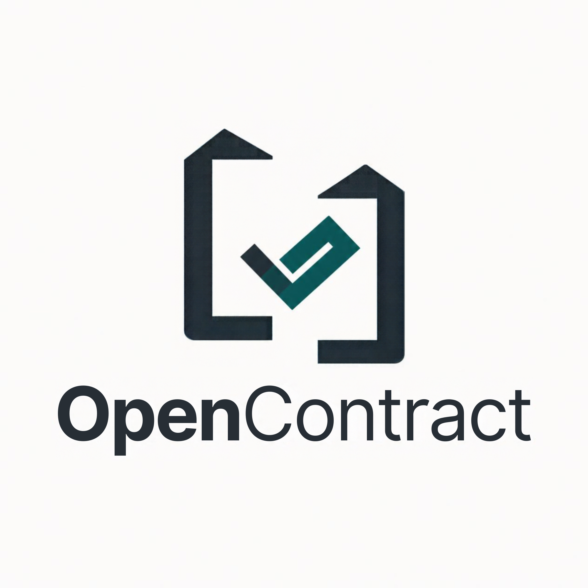

<div align="center">



# OpenContract

### *Public money should leave a public trail.*

**A blockchain-backed public procurement accountability and verification platform.**

[](https://nextjs.org/)
[](https://turbo.build/)
[](https://getfoundry.sh/)
[](https://soliditylang.org/)
[](https://neon.tech/)
[](https://www.prisma.io/)
[](https://ai.google.dev/)
[](https://sepolia.basescan.org/)
[](https://www.typescriptlang.org/)
[](LICENSE)

</div>

---

## 🏛️ Executive Summary

Public procurement represents approximately **12% of global GDP** and up to **30% of government expenditure in developing economies**. Yet, citizens, civil society watchdogs, investigative journalists, and oversight agencies often face opaque data silos, untracked contract amendments, missing audit trails, and document tampering.

**OpenContract** is an institutional-grade, light-first civic infrastructure platform designed to make public procurement transparent, traceable, and independently verifiable. By unifying the **Open Contracting Data Standard (OCDS 1.1)** with **EVM blockchain immutability (Base Sepolia)**, **client-side cryptographic hashing**, and **grounded Gemini AI intelligence**, OpenContract provides an unalterable trail for every public dollar.

---

## ⚡ Key Features

| Capability | Technical Mechanism | Civic Value |
| :--- | :--- | :--- |
| **Complete Lifecycle Tracking** | OCDS 1.1 normalized data model covering Planning, Tender, Bids, Evaluation, Award, Contract, Implementation, and Completion. | Prevents silent disappearance of tender requirements or post-award scope manipulation. |
| **Independent Verification Layer** | EVM Smart Registry on Base Sepolia (`OpenContractRegistry.sol`) anchoring cryptographic SHA-256 fingerprints of milestones and documents. | Anyone can verify procurement records without trusting OpenContract servers or hosting databases. |
| **Zero-Upload Document Verification** | Browser-side SHA-256 byte hashing via Web Crypto API. Files never leave the citizen's device. | Preserves confidentiality while detecting even single-byte modifications or altered payment figures. |
| **Deterministic Integrity Signals** | Automated rule engine scanning for single-bidder risks, contract amendments >15%, implementation delays, and supplier concentration. | Highlights records requiring scrutiny without making unsubstantiated accusations. |
| **Grounded AI Procurement Analyst** | Google Gemini integration with strict context injection of database-backed contracts, payments, and timeline data. | Allows citizens, journalists, and auditors to query complex procurement data in plain language with zero hallucination. |

---

## 🏗️ System Architecture

```
                                  ┌────────────────────────┐
                                  │      Citizen / Auditor │
                                  │     (Browser Session)  │
                                  └───────────┬────────────┘
                                              │ HTTPS / WebCrypto
                                              ▼
┌────────────────────────────────────────────────────────────────────────────────────────┐
│                               Next.js 15 App Router                                    │
│                                                                                        │
│  ┌───────────────────────┐  ┌───────────────────────┐  ┌────────────────────────────┐  │
│  │  Editorial Explorer   │  │  Document Verifier    │  │  AI Procurement Analyst    │  │
│  │  - OCDS 1.1 Pipeline  │  │  - In-browser SHA256  │  │  - Grounded Chat Interface │  │
│  │  - Milestone timeline │  │  - 1-Click Samples    │  │  - Direct entity citations │  │
│  │  - Amendment Tracker  │  │  - Checksum Lookup    │  │  - Follow-up query prompts │  │
│  └───────────────────────┘  └───────────────────────┘  └────────────────────────────┘  │
│                                                                                        │
│                          Edge API Routes (/api/v1/*)                                   │
└────────────────┬───────────────────────┬───────────────────────────────┬───────────────┘
                 │                       │                               │
                 │ Prisma ORM            │ REST API                      │ RPC / ethers
                 ▼                       ▼                               ▼
     ┌───────────────────────┐ ┌───────────────────┐           ┌───────────────────┐
     │   Neon Serverless     │ │ Google Gemini AI  │           │   Base Sepolia    │
     │   PostgreSQL DB       │ │ Flash Lite Engine │           │   EVM Blockchain  │
     │  - Procurements       │ │ - System Grounding│           │ - AccessController│
     │  - Contracts & Tenders│ │ - Entity Context  │           │ - OpenContract-   │
     │  - Milestones & Paym. │ │ - No Hallucination│           │   Registry.sol    │
     │  - Integrity Signals  │ └───────────────────┘           └───────────────────┘
     └───────────────────────┘
```

---

## 📜 Smart Contracts & Foundry Toolchain

The blockchain verification layer is built in **Solidity 0.8.28** and tested using the **Foundry** toolchain (`forge`, `cast`, `anvil`).

### Contract Architecture (`/contracts`)

- **`AccessController.sol`**: Multi-role governance defining `DEFAULT_ADMIN_ROLE`, `OFFICER_ROLE`, and `PUBLISHER_ROLE` with pause and emergency recovery capabilities.
- **`OpenContractRegistry.sol`**: High-throughput registry mapping each `ocid` (Open Contracting ID) to chronological procurement event fingerprints:
  ```solidity
  struct EventAnchor {
      bytes32 ocidHash;        // keccak256 hash of OCID
      bytes32 eventHash;       // SHA-256 digest of normalized event data
      bytes32 documentHash;    // SHA-256 fingerprint of attached PDF/document
      uint8 eventType;         // 1=Tender, 2=Award, 3=Contract, 4=Implementation, 5=Payment
      uint64 blockTimestamp;   // Immutable timestamp from block header
      address recordedBy;      // Authorized officer address
  }
  ```

### Foundry Test Suite

All smart contracts are validated under Foundry:

```bash
# Build contracts
pnpm contracts:build

# Run test suite
pnpm contracts:test
```

```
Ran 5 tests for test/OpenContractRegistry.t.sol:OpenContractRegistryTest
[PASS] test_AnchorEventByOfficer() (gas: 435938)
[PASS] test_InitialOwner() (gas: 39553)
[PASS] test_MultipleEventsForSameOCID() (gas: 731287)
[PASS] test_RevokePublisher() (gas: 88491)
[PASS] test_UnauthorizedCannotAnchor() (gas: 46593)
Suite result: ok. 5 passed; 0 failed; 0 skipped; finished in 4.44ms
```

---

## 🔍 In-Browser Document Verification

The verification system provides instant cryptographic proof:
1. **Local Hashing:** The citizen selects or drags a PDF document into the browser.
2. **Byte Fingerprinting:** The browser calculates `crypto.subtle.digest("SHA-256", buffer)` directly on the user's machine without transmitting the document.
3. **Database & Blockchain Cross-Check:** The hash is queried against the registered OpenContract repository and Base Sepolia ledger.
4. **Instant Diagnostic:**
   - **`VERIFIED`**: Exact match against registered public record and blockchain anchor.
   - **`MISMATCH / TAMPERED`**: Document contents have been altered (even a single changed comma or currency digit).
   - **`NOT_REGISTERED`**: Document has never been submitted or anchored.

---

## 🤖 AI Procurement Analyst (Gemini Flash Lite)

OpenContract integrates Google's **Gemini AI** (`gemini-flash-lite-latest`) configured with strict institutional grounding:
- The system prompt enforces **strict factual grounding** exclusively to the database records (tenders, awards, contracts, payments, milestone dates, and integrity signals).
- Speculation and external assumptions are explicitly disabled.
- Responses cite specific procurement identifiers (e.g., `GHA-PA-2026-0041`, `GHA-MOH-2025-0118`) and contract amounts.
- Users can ask natural language questions such as:
  - *"Which contracts have single-bidder flags or major cost overruns?"*
  - *"What is the completion status and payment progress on the Tema Port project?"*
  - *"Summarize the Ministry of Health medical equipment procurement history."*

---

## 📊 Standardized Data Model (OCDS 1.1)

OpenContract models data in adherence to the Open Contracting Data Standard:

```
Procurement (OCID)
│
├── Tender (Title, Criteria, Budget, Dates, Submission Method)
├── Bids (Bidder Org, Bid Amount, Compliance Status)
├── Awards (Awarded Supplier, Amount, Date)
├── Contracts (Original Value, Current Value, Signed Date, Period)
│    └── Payments (Amount, Reference, Date, Status, Recipient)
├── Milestones (Stage, Title, Due Date, Status)
├── Documents (Type, File Name, SHA-256 Hash, Size, MIME)
├── Integrity Signals (Type, Severity, Evidence, Rule Triggered)
└── Blockchain Anchors (Network, TX Hash, Block Number, Timestamp)
```

---

## 🚀 Quickstart & Local Setup

### 1. Prerequisites
- **Node.js** >= 20.0.0
- **pnpm** >= 10.0.0
- **Foundry** (`forge`, `cast`, `anvil`) — [Install Guide](https://getfoundry.sh/)
- **Neon PostgreSQL** serverless instance
- **Google Gemini API Key**

### 2. Clone and Install Dependencies

```bash
git clone https://github.com/charwayyyyyy/opencontract.git
cd opencontract

# Install all workspace dependencies
pnpm install
```

### 3. Environment Variables Configuration

Create a root `.env` file (and copy to `apps/web/.env`):

```bash
# Neon PostgreSQL Connection String (Pooler or Direct)
DATABASE_URL="postgresql://neondb_owner:<password>@<endpoint>.neon.tech/neondb?sslmode=require"

# Google Gemini AI API Key
GOOGLE_AI_API_KEY="your_gemini_api_key_here"
GEMINI_API_KEY="your_gemini_api_key_here"

# Blockchain RPC (Base Sepolia)
NEXT_PUBLIC_CHAIN_ID="84532"
NEXT_PUBLIC_RPC_URL="https://sepolia.base.org"
NEXT_PUBLIC_REGISTRY_ADDRESS="0x1111111111111111111111111111111111111111"
```

> **Security Note:** `.env` and `.env.*` files are strictly excluded in `.gitignore` to prevent any inadvertent credential exposure.

### 4. Database Setup & Seeding

Sync your schema with Neon PostgreSQL and seed realistic procurement records:

```bash
# Push Prisma schema to Neon PostgreSQL
pnpm db:push

# Generate client
pnpm db:generate

# Seed 5 comprehensive real-world public procurement cases
pnpm db:seed
```

### 5. Run the Application

```bash
# Start Turborepo development server
pnpm dev
```

Open [http://localhost:3000](http://localhost:3000) to view OpenContract in your browser.

---

## 🧪 Testing & Verification

```bash
# Run TypeScript compilation check across all packages
pnpm -r exec tsc --noEmit

# Run Foundry Solidity smart contract tests
pnpm contracts:test

# Run unit tests
pnpm test
```

---

## 🌐 Routes & Pages

| Route | Description |
| :--- | :--- |
| `/` | Landing page featuring procurement lifecycle overview, live statistics, hero search, and interactive verification demo. |
| `/explore` | Multi-filter procurement explorer with OCDS stages, buyer agencies, values, and search. |
| `/contracts/[ocid]` | Comprehensive procurement dossier with timeline, bids, contract amendments, payment milestones, anchored documents, and integrity flags. |
| `/verify` | In-browser SHA-256 document verifier with 1-click test samples and direct hash lookup. |
| `/signals` | Red-flag monitoring engine categorizing single-bidder, amendment overrun, delay, and concentration signals. |
| `/organizations` | Directory of procuring entities, procuring ministries, and private contractors. |
| `/analyst` | Grounded AI civic audit chat interface powered by Gemini Flash Lite. |
| `/methodology` | Documentation on data collection, OCDS standard compliance, and cryptographic verification guarantees. |

---

## 🔒 Security & Civic Integrity Guarantees

1. **Tamper-Evident Ledgers**: Once a milestone or document SHA-256 hash is anchored on Base Sepolia, it cannot be rewritten, backdated, or deleted.
2. **Local Cryptographic Privacy**: The citizen's documents are never uploaded to OpenContract servers for hashing.
3. **No Black-Box Accusations**: Integrity signals are deterministic, rule-based indicators flagged for review — never unverified allegations.
4. **Hallucination-Resistant AI**: The AI analyst answers exclusively from verified database records with entity citations.

---

## 📄 License

This project is licensed under the MIT License — see the [LICENSE](LICENSE) file for details.
